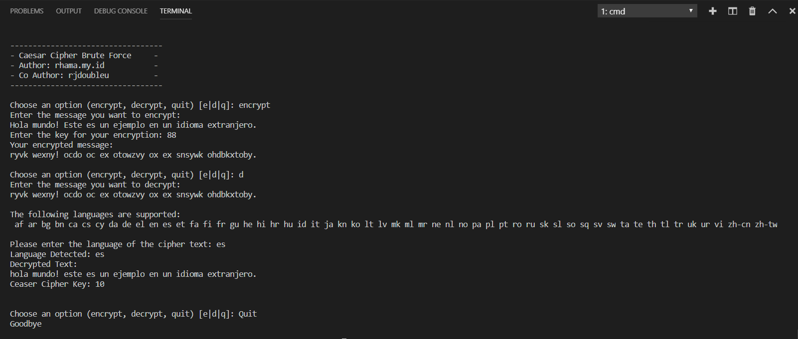

# Caesar Cipher Multi Lingual Brute Force
Implementing Caesar Cipher Brute Force With Python 3.

## Dependencies:
The current version utilizes a [port](https://pypi.org/project/langdetect/) of Google’s [language-detection](https://code.google.com/p/language-detection/) library (version from 03/03/2014) to Python.

**pip install langdetect**

## Usage
`python caesar_brute.py`

